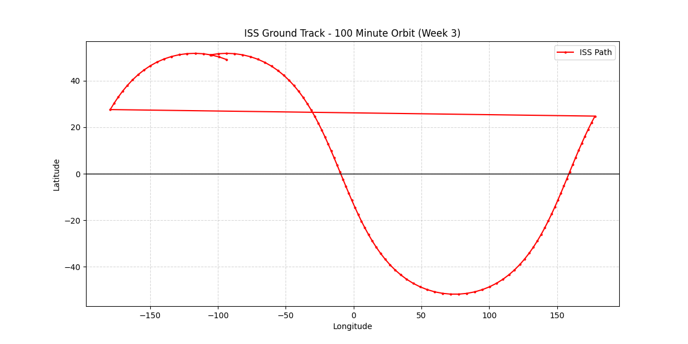

# 🛰️ She Orbits: Satellite Ground Tracking Project
**Researcher:** Yeabsira Wubishet Engda  
**Project Type:** Technical Sample & Modular Framework  
**Status:** Final Submission ✅

## 📌 Project Purpose
This repository is a **technical sample** designed for the She Orbits initiative. While it currently tracks the International Space Station (ISS), the code is built as a **modular framework**. 

This means the same logic can be used to track:
* 🛰️ **Weather Satellites** (NOAA)
* 📡 **Communication Constellations** (Starlink)
* 🧪 **Student CubeSats** (Future She Orbits missions)

## ✅ Monthly Deliverables Tracker
| Week | Objective | Status | Key Output |
| :--- | :--- | :--- | :--- |
| **1** | Research & Repo Setup | Completed | TLE Glossary & Project Architecture |
| **2** | Data Acquisition | Completed | Automated TLE Fetching Script |
| **3** | Orbital Propagation | Completed | SGP4 Nadir Point Calculation |
| **4** | Visualization & Reporting | Completed | ISS Ground Track Map |

## 📊 Scientific Output (Sample Plot)

---
*This framework is ready to be scaled for any LEO mission.*
